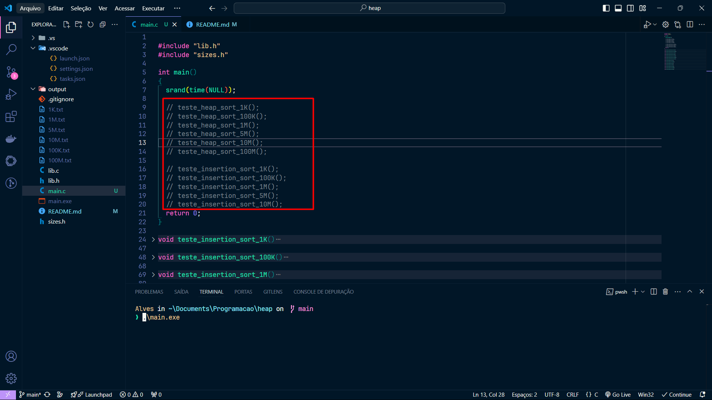

# Heap

- [x]  Subir
- [x]  Descer
- [x]  Construir
- [x]  Inserir
- [x]  Remover

# Algorítmos de ordenação
- [x]  Heap sort
- [x]  Insertion sort
- [x]  Implementar testes
    - [x]  Heap sort - 1K
        - 0.00 milissegundos
    - [x]  Heap sort - 100K
        - 0.00 milissegundos
    - [x]  Heap sort - 1M
        - 0.00 milissegundos
    - [x]  Heap sort - 10M
        - 3.000 milissegundos
    - [x]  Heap sort - 100M
        - 40.000 milissegundos
    - [x]  Heap sort - 1BI
        - Sem memória suficiente pra alocar
    - [x]  Insertion sort - 1K
        - 0.000 segundos
    - [x]  Insertion sort - 100K
        - 0.000 segundos
    - [x]  Insertion sort - 1M
        - 360.000 milssegundos
    - [ ]  Insertion sort - 5M
        - Ainda falta testar denovo
    - [x]  Insertion sort - 10M
        - Rodou por horas e não executou
    - [x]  Insertion sort - 1BI
        - Sem memória o suficiente pra alocar
- [x]  Relatório
    * https://docs.google.com/document/d/1u8uRsM9ONEogGW0Qc_iCaKbY-YM-MfgPSvf7qiiHUnU/edit#heading=h.u084as8stz7i

## Como executar o código?

1. Tu vai ter de instalar o compilador do C na tua máquina, qualquer coisa ver esse vídeo. https://www.youtube.com/watch?v=eDzQ6HkmGa4
2. Na pasta onde tá o projeto, abra um terminal e digite: 

```bash
 gcc main.c lib.c -o main   
```

3. Isso aí vai compilar o código. Agora é só executar o arquivo executável criado com: 

```bash
.\main.exe
```

4. Feito. O código vai executar. Mas lembra de de descomentar o teste que tu quer executar. (Executar um teste de cada vez, pois pode ocorrer de o segundo algoritmo não conseguir buscar o array que acabara de ser gravado no arquivo, e ele vir com o array todo preenchido por 0)



    
